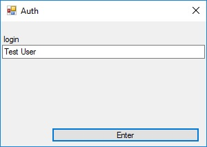
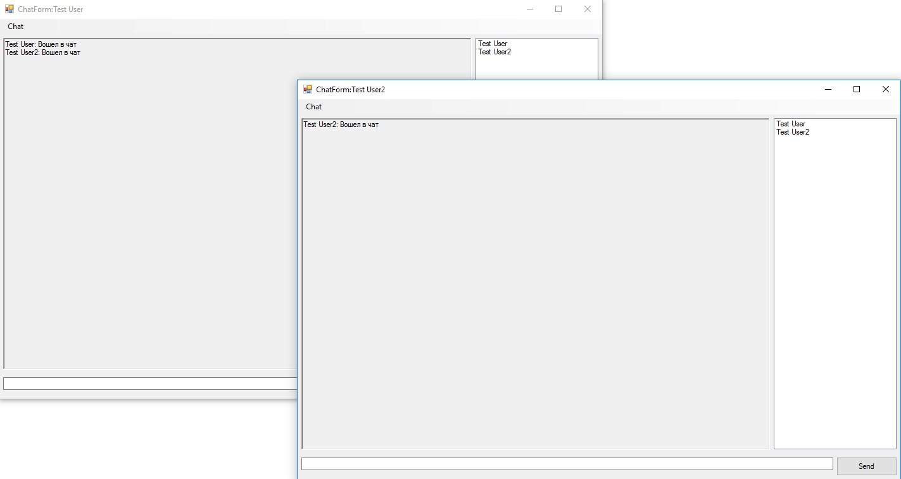
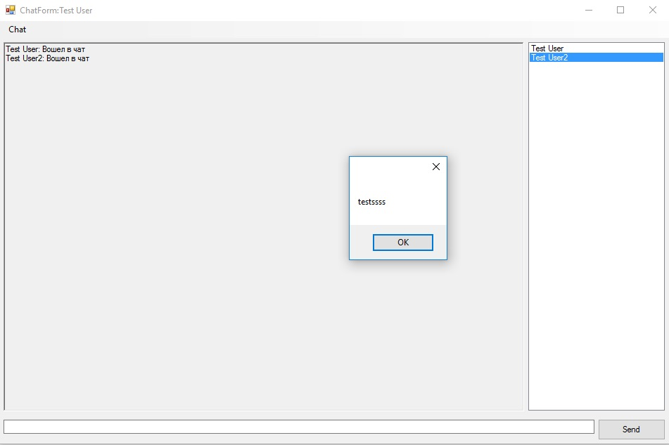

# Chat-Client

> Данное руководство предназначено для ознакомительных целей

Функции, реализованные в приложении:
- подключение к серверу
- отправка сообщений
- получение сообщений
- получение и отображение списка пользователей
- контроль состояния пользователей (не полностью)
- смена и вывод статуса пользователей

## Руководство

При запуске программы, будет запущено окно авторизации пользователя

При нажатии на кнопку Enter, на сервер будет отправлено сообщение об авторизации пользователя. Если пользователь уже был зарегистрирован, то будет получена вся его информация, которая хранится в БД сервера. Если же пользователь новый, то сначала будет создана запись в БД сервера, а после получена информация клиентом. Также, если пользователь уже находится в сети, зайти будет невозможно. Если же пользователь находился в сети, но вылетел, то будет произведено переподключение.

После авторизации пользователя на сервере, будет открыто главное окно приложения.

В верхней части приложения указан логин текущего пользователя. В меню Chat имеется кнопка Exit, которая позволяет выйти из приложения. В центре окна расположены окно сообщений и список активных пользователей. Внизу располагаются текстовое поле для ввода сообщения и кнопка для отправки.

При нажатии на пользователя в списке пользователей, будет открыто окно с выводом его статуса.

>Для смены статуса, пользователь должен отправить сообщение формата "\<текст статуса>

## Сообщения

|Сообщение|Описание|
|---|---|
|<Пользователь>:Вошел в чат|Пользователь подключился к серверу|
|<Пользователь>:Вышел из сети|Пользователь вышел из сети. Это могло произойти либо по команде Chat->Exit (сообщение появляется мгновенно), либо было закрыто окно клиентского приложения (сообщение появляется в течении 10 секунд)|
|<Пользователь>:Сменил статус:<текст статуса>|Пользователь сменил свой статус|

## Проблемы

- не реализованы обработки ошибок и проверка соединения
- не реализована проверка доступности сервера
- имеются вылеты
- не оптимизирован код